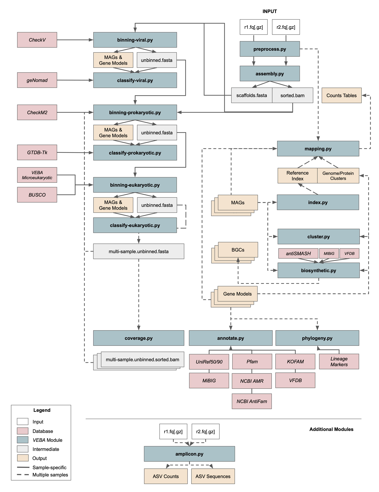

<a name="readme-top"></a>

  

[![Forks][forks-shield]][forks-url]
[![Stargazers][stars-shield]][stars-url]
[![Issues][issues-shield]][issues-url]


[forks-shield]: https://img.shields.io/github/forks/jolespin/veba.svg?style=for-the-badge
[forks-url]: https://github.com/jolespin/veba/members
[stars-shield]: https://img.shields.io/github/stars/jolespin/veba.svg?style=for-the-badge
[stars-url]: https://github.com/jolespin/veba/stargazers
[issues-shield]: https://img.shields.io/github/issues/jolespin/veba.svg?style=for-the-badge
[issues-url]: https://github.com/jolespin/veba/issues

```
 _    _ _______ ______  _______
  \  /  |______ |_____] |_____|
   \/   |______ |_____] |     |
```

### What is VEBA? 
The *Viral Eukaryotic Bacterial Archaeal* (VEBA) is an open-source software suite developed with all domains of microorganisms as the primary objective (not post hoc adjustments) including prokaryotic, eukaryotic, and viral organisms.  VEBA is an end-to-end metagenomics and bioprospecting software suite that can directly recover and analyze eukaryotic and viral genomes in addition to prokaryotic genomes with native support for candidate phyla radiation (CPR). VEBA implements a novel iterative binning procedure and an optional hybrid sample-specific/multi-sample framework that recovers more genomes than non-iterative methods.  To optimize the microeukaryotic gene calling and taxonomic classifications, VEBA includes a consensus microeukaryotic database containing protists and fungi compiled from several existing databases. VEBA also provides a unique clustering-based dereplication strategy allowing for sample-specific genomes and proteins to be directly compared across non-overlapping biological samples. VEBA also automates biosynthetic gene cluster identification and novelty scores for bioprospecting.

VEBA's mission is to make robust (meta-)genomics/transcriptomics analysis effortless.  The philosophy of VEBA is that workflows should be modular, generalizable, and easy-to-use with minimal intermediate steps.  The approach implemented in VEBA is to (try and) think 2 steps ahead of what you may need to do and automate the task for you.

<p align="right"><a href="#readme-top">^__^</a></p>

___________________________________________________________________

### Citation

Espinoza JL, Dupont CL. VEBA: a modular end-to-end suite for in silico recovery, clustering, and analysis of prokaryotic, microeukaryotic, and viral genomes from metagenomes. BMC Bioinformatics. 2022 Oct 12;23(1):419. [doi: 10.1186/s12859-022-04973-8](https://doi.org/10.1186/s12859-022-04973-8). PMID: 36224545.

Please cite the software dependencies described under the [*Dependency Citation Table*](CITATIONS.md).

<p align="right"><a href="#readme-top">^__^</a></p>

___________________________________________________________________

### Announcements

* **What's new in `VEBA v1.3.0`?**

* **`VEBA` Modules:**
	* Added `profile-pathway.py` module and associated scripts for building `HUMAnN` databases from *de novo* genomes and annotations.  Essentially, a reads-based functional profiling method via `HUMAnN` using binned genomes as the database.
	* Added `marker_gene_clustering.py` script which identifies core marker proteins that are present in all genomes within a genome cluster (i.e., pangenome) and unique to only that genome cluster.  Clusters in either protein or nucleotide space.
	* Added `module_completion_ratios.py` script which calculates KEGG module completion ratios for genomes and pangenomes. Automatically run in backend of `annotate.py`.
	* Updated `annotate.py` and `merge_annotations.py` to provide better annotations for clustered proteins.
	* Added `merge_genome_quality.py` and `merge_taxonomy_classifications.py` which compiles genome quality and taxonomy, respectively, for all organisms.
	* Added BGC clustering in protein and nucleotide space to `biosynthetic.py`.  Also, produces prevalence tables that can be used for further clustering of BGCs.
	* Added `pangenome_core_sequences` in `cluster.py` writes both protein and CDS sequences for each genome cluster.
	* Added PDF visualization of newick trees in `phylogeny.py`.

	
* **`VEBA` Database (`VDB_v5.2`)**:
	* Added `CAZy`
	* Added `MicrobeAnnotator-KEGG`

Check out the [*VEBA* Change Log](CHANGELOG.md) for insight into what is being implemented in the upcoming version.

<p align="right"><a href="#readme-top">^__^</a></p>

___________________________________________________________________


### Installation and databases

**Current Stable Version:** [`v1.3.0`](https://github.com/jolespin/veba/releases/tag/v1.3.0)

**Current Database Version:** `VDB_v5.2`

Please refer to the [*Installation and Database Configuration Guide*](install/README.md) for software installation and database configuration.

Docker containers are now available (starting with `v1.1.2`) for all modules via [DockerHub](https://hub.docker.com/repositories/jolespin)

<p align="right"><a href="#readme-top">^__^</a></p>

___________________________________________________________________

### Getting started with *VEBA*

[*Usage and Resource Requirements Guide*](src/README.md) for parameters and module descriptions

[*Walkthrough Guides*](walkthroughs/README.md) for tutorials and workflows on how to get started
 
<p align="right"><a href="#readme-top">^__^</a></p>

___________________________________________________________________

### What does *VEBA* do?

Please refer to the [*Modules*](src/README.md) for a description of all *VEBA* modules and their functionality.

If you wish *VEBA* did something that isn't implemented, please submit a [`[Feature Request Issue]`](https://github.com/jolespin/veba/issues/new/choose).

[](images/Schematic.pdf)

<p align="right"><a href="#readme-top">^__^</a></p>

___________________________________________________________________

### Output structure
*VEBA*'s is built on the [*GenoPype*](https://github.com/jolespin/genopype) archituecture which creates a reproducible and easy-to-navigate directory structure.  *GenoPype*'s philosophy is to use the same names for all files but to have sample names as subdirectories.  This makes it easier to glob files for grepping, concatenating, etc. *NextFlow* support is in the works...

Example of *GenoPype*'s layout:

```
# Project directory
project_directory/

# Temporary directory
project_directory/tmp/

# Log directory
project_directory/logs/
project_directory/logs/[step]__[program-name].e
project_directory/logs/[step]__[program-name].o
project_directory/logs/[step]__[program-name].returncode

# Checkpoint directory
project_directory/checkpoints/
project_directory/checkpoints/

# Intermediate directories for each step
project_directory/intermediate/
project_directory/intermediate/[step]__[program-name]/

# Output directory
project_directory/output/

# Commands
project_directory/commands.sh
```


For *VEBA*, it has all the directories created by `GenoPype` above but is built for having multiple samples under the same project. 

Example of *VEBA*'s default directory layout:

```
ID="sample_1"

# Main output directory
veba_output/

# Assembly directory
veba_output/assembly

# Assembly output for ${ID} sample
veba_output/assembly/${ID}/output/

# Prokaryotic binning for ${ID} sample
veba_output/binning/prokaryotic/${ID}/output/ 

# Eukaryotic binning
veba_output/binning/eukaryotic/${ID}/output/

# Viral binning
veba_output/binning/viral/${ID}/output/
```

The above are default output locations but they can be customized.


<p align="right"><a href="#readme-top">^__^</a></p>

___________________________________________________________________

### Frequently Asked Questions

If perusing the [*Frequently Asked Questions*](FAQ.md) doesn't address your question, feel free to submit a [[`Question Issue`]](https://github.com/jolespin/veba/issues/new) 

<p align="right"><a href="#readme-top">^__^</a></p>

___________________________________________________________________

